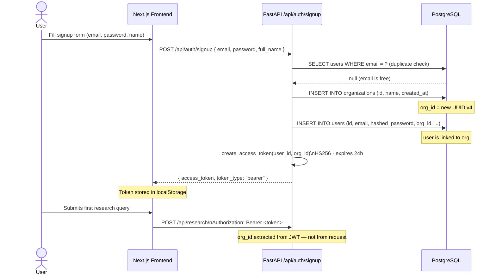
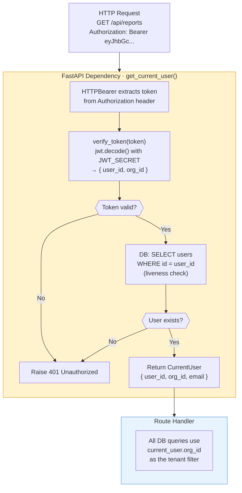
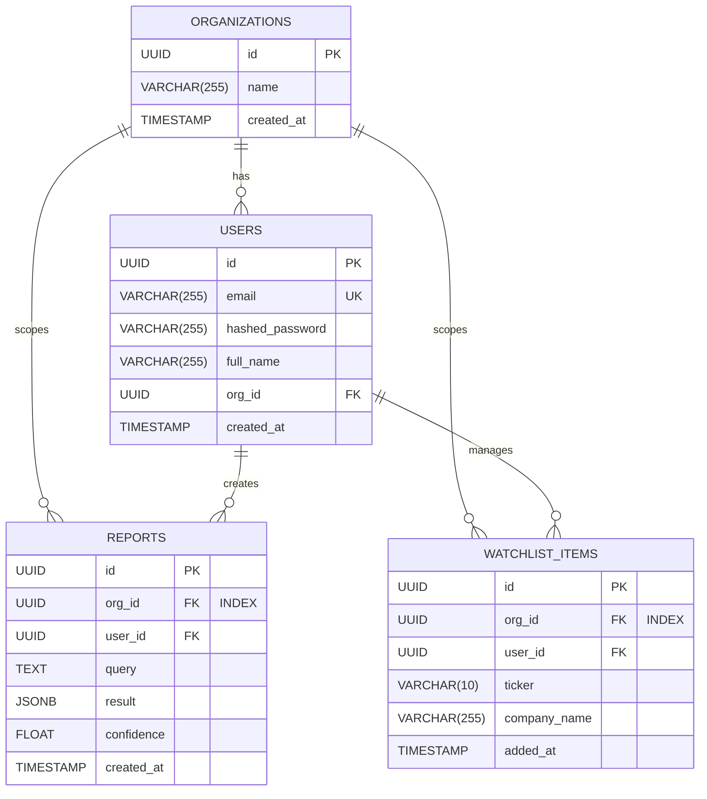

# Multi-Tenant Architecture — Investment Research Dashboard

## Table of Contents
1. [Tenancy Model](#1-tenancy-model)
2. [Tenant Lifecycle — Signup to First Request](#2-tenant-lifecycle--signup-to-first-request)
3. [JWT Token Structure & Tenant Identity](#3-jwt-token-structure--tenant-identity)
4. [Auth Middleware — How Tenant Context Is Established](#4-auth-middleware--how-tenant-context-is-established)
5. [Database Schema — Shared Tables with Row-Level Isolation](#5-database-schema--shared-tables-with-row-level-isolation)
6. [Tenant Filter Enforcement per Resource](#6-tenant-filter-enforcement-per-resource)
7. [Data Isolation Proof — Org A vs Org B](#7-data-isolation-proof--org-a-vs-org-b)
8. [Tenant Isolation Rules Summary](#8-tenant-isolation-rules-summary)
9. [Security Boundaries](#9-security-boundaries)
10. [Future Extension Path](#10-future-extension-path)

---

## 1. Tenancy Model

**Multi-tenancy** simply means: many different people storing their own private data in the same system, without ever being able to see each other's data. Think of it like a block of flats — everyone lives in the same building and shares the same infrastructure (plumbing, electricity), but each flat is completely locked off from the others.

This system uses a **single shared database** where all users' data lives together in the same tables. The privacy comes not from physically separating the data, but from a strict rule baked into every database query: you can only ever read or write rows that are tagged with your own workspace ID.

### How It Works — Invisible Workspace per User

```
┌─────────────────────────────────────────────────────┐
│  User signs up with email + password                │
│                                                     │
│  Backend automatically:                             │
│  1. Creates  Organization { id, name }              │
│  2. Creates  User { id, email, org_id → org.id }    │
│  3. Issues   JWT { sub: user_id, org_id: org.id }   │
│                                                     │
│  The user never sees "organization" anywhere in UI  │
└─────────────────────────────────────────────────────┘
```

When you sign up, the server silently creates a private workspace for you and links your account to it. You never see it, name it, or interact with it — it just exists in the background. Every report you save and every company you add to your watchlist is automatically stamped with your workspace ID.

The architecture is already structured to support teams sharing one workspace in the future (e.g. inviting a colleague) — without any changes to the database structure.

---

## 2. Tenant Lifecycle — Signup to First Request

This diagram shows the full journey from filling in the signup form to making your first research request — and exactly where your private workspace ID gets created and attached to your account.



---

## 3. JWT Token Structure & Tenant Identity

When you log in, the server gives you a **login token** — a small, digitally signed string that proves who you are. You attach this token to every request you make, and the server reads it to know both *who you are* (your user ID) and *which workspace is yours* (your workspace ID). It is like a signed wristband at an event — it tells security exactly who you are and what areas you are allowed into, without needing to look you up every time from scratch.

### What Is Inside the Token

The token contains three key pieces of information:

```json
{
  "sub":    "3fa85f64-5717-4562-b3fc-2c963f66afa6",
  "org_id": "8e72c4b1-0f3a-4d2e-b1c5-9a7f2e3d4c5b",
  "iat":    1713744000,
  "exp":    1713830400
}
```

| Field | Meaning |
|---|---|
| `sub` | Your personal user ID |
| `org_id` | Your private workspace ID (the tenant key used on every data query) |
| `iat` | The time the token was created |
| `exp` | The time the token expires (24 hours after creation) |

### How the Token Is Protected

The token is cryptographically signed by the server using a secret key that only the server knows. This means:
- If anyone tampers with the token (e.g. tries to change the workspace ID to someone else's), the signature breaks and the server immediately rejects it.
- The workspace ID is written into the token **by the server at login** — you cannot supply your own or change it.

### The Code That Creates the Token (`backend/app/auth/jwt.py`)

```python
def create_access_token(user_id: UUID, org_id: UUID, ...) -> str:
    payload = {
        "sub":    str(user_id),
        "org_id": str(org_id),
        "exp":    datetime.utcnow() + timedelta(minutes=1440),
        "iat":    datetime.utcnow(),
    }
    return jwt.encode(payload, settings.JWT_SECRET, algorithm="HS256")
```

---

## 4. Auth Middleware — How Tenant Context Is Established

Before any protected page or data can be accessed, the server runs an identity check. This check happens automatically on every single request — you never call it manually. Think of it as a security desk at a building entrance: before you can go to any floor, your ID badge is scanned, verified as genuine, and checked that you still work there.



### The "Current User" Object

Once the identity check passes, the server creates a small container object holding three things: your user ID, your workspace ID, and your email. This is the **only way** the workspace ID reaches the database query — it is never read from the URL, the query string, or anything the user sends.

---

## 5. Database Schema — Shared Tables with Row-Level Isolation

All users share the same four database tables. Privacy is enforced not by keeping the tables separate, but by tagging every row with a workspace ID and only ever fetching rows that match *your* workspace ID. The diagram below shows the four tables and how they link to each other.



### Why Indexes Matter Here

An index is like a book's index — instead of reading every page to find a word, you jump straight to the right page. Without indexes on the workspace ID column, every query would have to scan every row in the table to find yours, which would get slower and slower as the database grows.

| Table | Indexed Column | What It Speeds Up |
|---|---|---|
| `users` | `email` | Finding your account during login |
| `reports` | `org_id` | Listing all reports in your workspace |
| `watchlist_items` | `org_id` | Listing all watchlist items in your workspace |
| `watchlist_items` | `(user_id, ticker)` | Preventing the same company being added twice |

---

## 6. Tenant Filter Enforcement per Resource

Here is exactly how each type of database query locks itself to your workspace. The code and the SQL it generates are shown side by side.

```python
# backend/app/reports/router.py
stmt = (
    select(Report)
    .where(Report.org_id == current_user.org_id)   # ← tenant filter
    .order_by(desc(Report.created_at))
)
```

Generated SQL:
```sql
SELECT * FROM reports
WHERE org_id = '8e72c4b1-...'   -- injected from JWT, never from client
ORDER BY created_at DESC;
```

---

### Opening a Single Report

```python
result = await db.execute(
    select(Report).where(
        Report.id      == report_id,             # ← resource identity
        Report.org_id  == current_user.org_id,   # ← tenant guard
    )
)
```

Generated SQL:
```sql
SELECT * FROM reports
WHERE id = $1
  AND org_id = '8e72c4b1-...';  -- must match BOTH conditions
```

The database must match **both** the report ID **and** your workspace ID. If the report exists but belongs to someone else, the database returns nothing — and the server tells you "not found". This means an attacker cannot even confirm whether a report with a given ID exists in the system.

---

### Saving a New Report

```python
report = Report(
    org_id   = current_user.org_id,   # ← stamped from JWT
    user_id  = current_user.user_id,
    query    = request.query,
    result   = request.result,
    confidence = request.confidence,
)
```

Your workspace ID is **always taken from your verified login token** — never from anything you send in the request body. You cannot trick the system into saving a report under a different workspace.

---

### Watchlist — Exactly the Same Pattern

Every watchlist query follows the identical three rules: list queries filter by workspace, single-record lookups check both the item ID and workspace, and new items are always stamped with your workspace ID from the login token.

```python
# List — tenant-scoped
select(WatchlistItem).where(WatchlistItem.org_id == current_user.org_id)

# Single record — dual guard
select(WatchlistItem).where(
    WatchlistItem.id     == item_id,
    WatchlistItem.org_id == current_user.org_id,
)

# Write — org_id stamped from JWT
WatchlistItem(org_id=current_user.org_id, user_id=current_user.user_id, ...)
```

---

## 7. Data Isolation Proof — Workspace A vs Workspace B

The diagram below shows two completely separate users. Even though their data lives in the same database tables, the workspace ID filter means their data never crosses paths.
        UserA["User A\nJWT: org_id=aaaa"]
        DataA["Reports & Watchlist\norg_id = aaaa"]
    end

    subgraph OrgB["Workspace B (org_id: bbbb-...)"]
        UserB["User B\nJWT: org_id=bbbb"]
        DataB["Reports & Watchlist\norg_id = bbbb"]
    end

    subgraph DB["PostgreSQL — shared tables"]
        RowsA["rows where org_id = aaaa"]
        RowsB["rows where org_id = bbbb"]
    end

    UserA -->|"WHERE org_id = aaaa"| RowsA
    UserB -->|"WHERE org_id = bbbb"| RowsB

    UserA -. "Cannot access" .-> RowsB
    UserB -. "Cannot access" .-> RowsA

    style OrgA fill:#e8f4fd,stroke:#4a90d9
    style OrgB fill:#fff3cd,stroke:#d4a017
    style DB fill:#f0fff0,stroke:#5cb85c
```

### What Happens When Someone Tries to Access Another User's Data

Suppose User A somehow learns the ID of one of User B's saved reports and tries to open it directly:

```
GET /api/reports/b1c2d3e4-...
Authorization: Bearer <User A's JWT>
```

Query executed:
```sql
SELECT * FROM reports
WHERE id      = 'b1c2d3e4-...'     -- User B's report UUID
  AND org_id  = 'aaaa-...'          -- User A's org from JWT
```

Result: **zero rows returned** → the server responds with `404 Not Found`.

User A gets no information — not even confirmation that this report ID exists anywhere in the system.

---

## 8. Tenant Isolation Rules — Quick Reference

Every rule that keeps one user's data completely separate from another's, and exactly where in the code it is enforced:

| Rule | Where Enforced | Code Location |
|---|---|---|
| Workspace ID is never accepted from the user's request | Route handlers | All routers — workspace ID only comes from the verified login token |
| Every "list all" query filters by workspace ID | Database queries | `reports/router.py`, `watchlist/router.py` |
| Every new row is stamped with workspace ID from the login token | Row creation | `reports/router.py`, `watchlist/router.py` |
| Single-record fetches check both the record ID and workspace ID | Database queries | All `GET /{id}` and `DELETE /{id}` handlers |
| Wrong workspace returns "not found", not "forbidden" | HTTP response | Prevents confirming whether a record exists |
| Workspace ID in the login token is written by the server at login | Token issuance | `auth/jwt.py` |
| Login token signature is verified on every request | Middleware | `auth/dependencies.py` |
| User account is confirmed still active on every request | Middleware | Database lookup in `auth/dependencies.py` |

---

## 9. Security Boundaries

The diagram below shows the line of trust — everything inside the boundary is controlled by the server and cannot be faked by a user. The workspace ID only ever moves from the server-signed login token into the database query — it never comes from user input.
│ TRUST BOUNDARY — Nothing inside this line trusts client input    │
│                                                                  │
│  ┌──────────────┐    ┌────────────────────────────────────────┐  │
│  │  JWT Token   │    │  get_current_user() dependency         │  │
│  │              │    │                                        │  │
│  │  org_id is   │───▶│  1. Signature verified (HS256)        │  │
│  │  written by  │    │  2. Expiry checked                    │  │
│  │  the SERVER  │    │  3. user_id looked up in DB           │  │
│  │  at login    │    │  4. org_id returned as CurrentUser    │  │
│  └──────────────┘    └────────────────────────────────────────┘  │
│                                                  │               │
│                               ┌──────────────────▼────────────┐  │
│                               │  Route Handler                │  │
│                               │                               │  │
│                               │  All queries:                 │  │
│                               │  WHERE org_id = current.org_id│  │
│                               └───────────────────────────────┘  │
└──────────────────────────────────────────────────────────────────┘
```

### Known Gaps — What This Layer Does Not Yet Cover

These are security improvements that were not built during the initial 5-day timeline:

| Concern | Current Situation | What Should Be Done |
|---|---|---|
| Where the login token is stored | Stored in the browser in a way that JavaScript can read (XSS risk) | Move it to a storage area that JavaScript cannot access |
| Login token renewal | Single token lasting 24 hours — no automatic silent renewal | Add a background renewal so users are never suddenly logged out |
| Request rate limiting | No limit on how many requests a workspace can make per minute | Add a per-workspace limit to prevent abuse and protect API quotas |
| Cross-origin access | Currently accepts requests from any website (dev setting) | Lock down to only the known frontend URL in production |
| Brute-force login | No lockout after repeated failed login attempts | Add a counter that temporarily blocks an email after too many failures |

---

## 10. Future Extension Path

The current database structure is already designed to support these features — none of them require changing the tables or losing existing data:

### Multiple Users Sharing One Workspace

Right now each user gets their own private workspace. But the database already supports multiple users linked to the same workspace. To allow team members to share a workspace, only one new feature is needed:

1. An "invite" endpoint that creates a new user account linked to an existing workspace ID.
2. No database changes needed — reports and watchlist items saved by any user in the workspace are already tagged with the shared workspace ID, so they automatically become visible to all members.

### Roles Within a Workspace (Owner, Member, Viewer)

Add a `role` field to user accounts (`owner`, `member`, `viewer`). The data isolation rules stay exactly the same — the only change is that write operations (saving, deleting) check the role before proceeding.

### Private Document Libraries per Workspace

The document search currently uses a single shared library of sample financial reports. To give each workspace its own private library of uploaded documents:

1. Tag each document with a workspace ID when it is uploaded.
2. At search time, only return documents tagged with the requesting user's workspace ID.
3. Or store each workspace's documents in a separate folder on disk.

### Visual Summary — Now vs Future

```
Current                          Future (no schema changes needed)
────────────────────             ────────────────────────────────
Org A ──── User A                Org A ──── User A (owner)
                                       └── User B (member)
                                       └── User C (viewer)

Org B ──── User B                Org B ──── User D (owner)
                                       └── User E (member)
```
