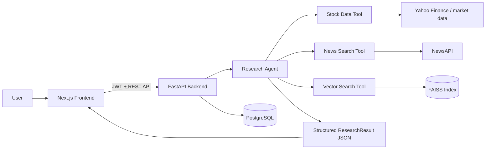

# Investment Research Dashboard

An AI-powered full-stack dashboard for financial research. The application lets a user sign up, submit a natural-language company or stock query, and receive structured insights backed by real tool calls for stock prices, news, and vector-searched financial documents.

---

## 1. Architecture of the Project

### High-Level Architecture

This project follows a layered architecture:

1. **Presentation Layer** — a Next.js frontend renders authentication screens, the dashboard, reports, and watchlist pages.
2. **API Layer** — a FastAPI backend exposes REST endpoints for auth, research, reports, and watchlist actions.
3. **AI Orchestration Layer** — a LangChain-based research agent uses external tools to fetch grounded financial data.
4. **Data Layer** — PostgreSQL stores users, organizations, reports, and watchlist records, while FAISS stores searchable financial knowledge.

### Architecture Diagram



### How the Architecture Works

- The **frontend** sends authenticated requests to the backend using the token stored after login.
- The **backend** validates the token, routes the request, and triggers the research agent.
- The **research agent** uses tool calls instead of relying only on the model, which improves reliability and explainability.
- The **database** persists user-specific data such as reports and watchlist items.
- The **frontend renderer** turns structured JSON sections into cards, charts, tables, and news blocks.

---

## 2. Workflow of the Project

### End-to-End User Workflow

1. **User signs up or logs in**
   - The frontend pages call the auth API.
   - The backend creates a user and a one-user organization, then returns a JWT.

2. **JWT token is stored in the browser**
   - The frontend saves the token in local storage.
   - Protected dashboard pages use this token for future requests.

3. **User submits a research query**
   - Example: *Analyze Apple stock performance*.
   - The dashboard sends the query to the research endpoint.

4. **Backend validates the user**
   - FastAPI dependencies decode the JWT.
   - The request is linked to the correct organization and user context.

5. **Research agent runs**
   - The agent uses the stock, news, and vector search tools.
   - Tool outputs are validated and converted into a structured response schema.

6. **Structured result is returned**
   - The backend returns a `ResearchResult` containing sections, reasoning, confidence, and execution steps.

7. **Frontend renders explainable output**
   - Charts, cards, tables, and news blocks are shown through reusable UI components.
   - The user can inspect the AI reasoning and the execution timeline.

8. **Optional persistence actions**
   - The user can save the research result as a report.
   - The user can also add companies to a watchlist for quick future access.

---

## 3. Tech Stack Used in the Project

| Layer | Tech Stack | Purpose |
|---|---|---|
| Frontend | Next.js 16, React 19, TypeScript | UI rendering and client-side interactions |
| Styling | Global CSS | Dashboard, auth, and component styling |
| Charts | Recharts | Line and bar visualizations |
| Backend API | FastAPI, Uvicorn | REST API and async request handling |
| ORM / DB Access | SQLAlchemy Async, asyncpg | PostgreSQL communication |
| Database | PostgreSQL 16 | Persistent app data |
| Authentication | JWT, python-jose, passlib, bcrypt | Secure login and tenant-scoped access |
| AI Orchestration | LangChain | Tool-based research flow |
| LLM | Groq via `langchain-groq` | Agent reasoning and JSON response generation |
| Embeddings | Google Generative AI Embeddings | Vector search embeddings |
| Vector Store | FAISS | Document similarity search |
| Financial Data | yfinance, requests | Stock market and company data retrieval |
| News Source | NewsAPI | Recent financial news retrieval |
| Dev / Deployment | Docker, Docker Compose | Multi-service local environment |
| Code Quality | ESLint, TypeScript | Frontend linting and type safety |
| Testing | pytest | Validation and e2e testing |

---

## 4. Directory Structure of the Project

```text
Investment-Research-Dashboard/
├── docker-compose.yml
├── README.md
├── backend/
│   ├── Dockerfile
│   ├── requirements.txt
│   ├── app/
│   │   ├── __init__.py
│   │   ├── config.py
│   │   ├── main.py
│   │   ├── auth/
│   │   │   ├── __init__.py
│   │   │   ├── dependencies.py
│   │   │   ├── jwt.py
│   │   │   ├── models.py
│   │   │   ├── router.py
│   │   │   └── schemas.py
│   │   ├── db/
│   │   │   ├── __init__.py
│   │   │   └── database.py
│   │   ├── reports/
│   │   │   ├── __init__.py
│   │   │   ├── models.py
│   │   │   ├── router.py
│   │   │   └── schemas.py
│   │   ├── research/
│   │   │   ├── __init__.py
│   │   │   ├── agent.py
│   │   │   ├── router.py
│   │   │   ├── schemas.py
│   │   │   └── tools/
│   │   │       ├── __init__.py
│   │   │       ├── news_search.py
│   │   │       ├── stock_data.py
│   │   │       └── vector_search.py
│   │   └── watchlist/
│   │       ├── __init__.py
│   │       ├── models.py
│   │       ├── router.py
│   │       └── schemas.py
│   ├── data/
│   │   └── build_faiss_index.py
│   ├── tests/
│   │   ├── __init__.py
│   │   ├── test_research_e2e.py
│   │   └── test_research_validation.py
│   └── tmp/
│       └── test_json_agent.py
├── frontend/
│   ├── AGENTS.md
│   ├── CLAUDE.md
│   ├── Dockerfile
│   ├── eslint.config.mjs
│   ├── next-env.d.ts
│   ├── next.config.ts
│   ├── package.json
│   ├── README.md
│   ├── tsconfig.json
│   ├── public/
│   └── src/
│       ├── app/
│       │   ├── globals.css
│       │   ├── layout.tsx
│       │   ├── (dashboard)/
│       │   │   ├── layout.tsx
│       │   │   ├── page.tsx
│       │   │   ├── reports/
│       │   │   │   ├── page.tsx
│       │   │   │   └── [id]/
│       │   │   │       └── page.tsx
│       │   │   └── watchlist/
│       │   │       └── page.tsx
│       │   ├── login/
│       │   │   └── page.tsx
│       │   └── signup/
│       │       └── page.tsx
│       ├── components/
│       │   ├── charts/
│       │   │   ├── BarChart.tsx
│       │   │   └── LineChart.tsx
│       │   └── dashboard/
│       │       ├── CardGrid.tsx
│       │       ├── ConfidenceScore.tsx
│       │       ├── ExecutionSteps.tsx
│       │       ├── ExplainabilityPanel.tsx
│       │       ├── NewsCards.tsx
│       │       ├── ResearchInput.tsx
│       │       ├── SaveReportButton.tsx
│       │       ├── SectionRenderer.tsx
│       │       └── TableSection.tsx
│       └── lib/
│           ├── api.ts
│           └── auth.ts
└── openspec/
    ├── config.yaml
    ├── changes/
    │   ├── archive/
    │   ├── investment-research-dashboard/
    │   │   ├── design.md
    │   │   ├── proposal.md
    │   │   ├── tasks.md
    │   │   └── specs/
    │   └── strict-ai-tool-grounding/
    │       ├── design.md
    │       ├── proposal.md
    │       ├── tasks.md
    │       └── specs/
    └── specs/
```

---

## 5. Dependencies Used

### Backend Dependencies

| Package | Version | Why it is used |
|---|---:|---|
| fastapi | 0.115.6 | Main Python web framework |
| uvicorn[standard] | 0.34.0 | ASGI app server |
| sqlalchemy[asyncio] | 2.0.36 | Async ORM and DB models |
| asyncpg | 0.30.0 | PostgreSQL async driver |
| alembic | 1.14.1 | Database migration support |
| python-jose[cryptography] | 3.3.0 | JWT token creation and verification |
| passlib[bcrypt] | 1.7.4 | Password hashing utilities |
| bcrypt | 4.0.1 | Secure password hashing backend |
| langchain | 0.3.14 | AI workflow orchestration |
| langchain-google-genai | 2.0.8 | Google embeddings integration |
| langchain-groq | 0.2.4 | Groq LLM integration |
| langchain-community | 0.3.14 | Community tools and vector utilities |
| faiss-cpu | 1.9.0.post1 | Vector search engine |
| yfinance | 0.2.51 | Stock price and company data |
| requests | 2.32.3 | External HTTP API calls |
| pydantic[email] | 2.10.4 | Schema validation |
| pydantic-settings | 2.7.1 | Environment-driven config loading |
| python-dotenv | 1.0.1 | Load environment variables from `.env` |
| python-multipart | 0.0.20 | Form request parsing support |
| httpx | 0.28.1 | Async HTTP client |

### Frontend Dependencies

| Package | Version | Why it is used |
|---|---:|---|
| next | 16.2.4 | Full-stack React framework |
| react | 19.2.4 | UI rendering |
| react-dom | 19.2.4 | Browser DOM integration |
| recharts | 3.8.1 | Charts for stock and comparison views |

### Frontend Dev Dependencies

| Package | Version | Why it is used |
|---|---:|---|
| typescript | ^5 | Strong typing and maintainability |
| eslint | ^9 | Linting and code quality |
| eslint-config-next | 16.2.4 | Next.js linting rules |
| @types/node | ^20 | Node.js typings |
| @types/react | ^19 | React typings |
| @types/react-dom | ^19 | DOM typings for React |

### External Services and Runtime Dependencies

- **PostgreSQL 16 Alpine** for data persistence.
- **Docker Compose** for running frontend, backend, and database together.
- **Groq API key** for the LLM-driven research agent.
- **Google Gemini API key** for embeddings and FAISS document indexing.
- **NewsAPI key** for live news retrieval.
- **Yahoo Finance data access** for market and company data.

---

## 6. File-by-File Explanation

The tables below explain each important file using three ideas:
- **Definition** — what the file is.
- **Reason of creation** — why the file exists.
- **Relation** — how it works with other files.

### Root-Level Files

| File | Definition | Reason of creation | Relation with other files |
|---|---|---|---|
| `docker-compose.yml` | Service orchestration file. | To run PostgreSQL, backend, and frontend together. | Starts the containers defined by both Dockerfiles and injects environment variables into the backend and frontend. |
| `README.md` | Main project documentation. | To explain the system, stack, workflow, and usage. | Describes everything in the repository for contributors and reviewers. |

### Backend Runtime Files

| File | Definition | Reason of creation | Relation with other files |
|---|---|---|---|
| `backend/Dockerfile` | Backend container definition using Python 3.11. | To package and run the FastAPI app consistently. | Installs `requirements.txt` and launches `app.main:app`. |
| `backend/requirements.txt` | Python dependency list. | To pin backend packages and make setup reproducible. | Used by the backend Docker image and local Python installs. |

### Backend Core App Files

| File | Definition | Reason of creation | Relation with other files |
|---|---|---|---|
| `backend/app/__init__.py` | Python package marker. | To make the `app` folder importable. | Allows modules like `app.main` and `app.auth.router` to be imported cleanly. |
| `backend/app/config.py` | Central configuration module. | To load settings such as DB URL, JWT secret, and API keys from environment variables. | Used by `main.py`, `database.py`, `jwt.py`, and research tools. |
| `backend/app/main.py` | FastAPI application entry point. | To initialize the app, register routers, and create tables at startup. | Imports routers from auth, research, reports, and watchlist; uses DB config and settings. |

### Backend Database Files

| File | Definition | Reason of creation | Relation with other files |
|---|---|---|---|
| `backend/app/db/__init__.py` | Package marker for DB utilities. | To group database helpers into a Python package. | Supports imports from the DB module. |
| `backend/app/db/database.py` | Async SQLAlchemy engine/session setup. | To centralize DB connection handling and the declarative base. | Used by all model and router files that need sessions or database transactions. |

### Backend Authentication Files

| File | Definition | Reason of creation | Relation with other files |
|---|---|---|---|
| `backend/app/auth/__init__.py` | Package marker for auth logic. | To organize authentication-related code. | Connects the auth package to the rest of the backend. |
| `backend/app/auth/models.py` | Database models for `Organization` and `User`. | To store users and create tenant isolation using `org_id`. | Referenced by auth routes, dependencies, and report/watchlist foreign keys. |
| `backend/app/auth/schemas.py` | Pydantic input/output schemas for auth requests and responses. | To validate login/signup payloads and structure API responses. | Used by `router.py` and indirectly by the frontend API client. |
| `backend/app/auth/jwt.py` | JWT helper functions. | To create and verify access tokens securely. | Called by auth routes and the `get_current_user` dependency. |
| `backend/app/auth/dependencies.py` | FastAPI auth dependency definitions. | To protect endpoints and extract the current authenticated user. | Used by research, reports, and watchlist routers. |
| `backend/app/auth/router.py` | Auth endpoint definitions. | To provide `/signup`, `/login`, and `/me` functionality. | Uses auth models, schemas, password hashing, JWT helpers, and DB sessions. |

### Backend Research Files

| File | Definition | Reason of creation | Relation with other files |
|---|---|---|---|
| `backend/app/research/__init__.py` | Package marker for research features. | To group AI-related modules. | Enables clean imports for the research subsystem. |
| `backend/app/research/schemas.py` | Structured schema for research results. | To standardize the format returned by the AI pipeline. | The backend returns this model and the frontend renders it through `SectionRenderer.tsx`. |
| `backend/app/research/router.py` | Research API endpoint. | To accept user queries and call the research agent. | Protected by auth dependency and powered by `agent.py`. |
| `backend/app/research/agent.py` | Core AI orchestration module. | To run the LangChain agent, call tools, validate grounded output, and produce `ResearchResult`. | Uses the tool files, the research schema, and config settings. |

### Backend Research Tool Files

| File | Definition | Reason of creation | Relation with other files |
|---|---|---|---|
| `backend/app/research/tools/__init__.py` | Package marker for tool modules. | To group all research tools together. | Imported by the research agent. |
| `backend/app/research/tools/stock_data.py` | Stock-data retrieval tool. | To fetch company metrics and historical prices for the agent. | Called by `agent.py`; its output is rendered by chart and card components in the frontend. |
| `backend/app/research/tools/news_search.py` | News retrieval tool. | To fetch recent company-related articles and sentiment context. | Called by `agent.py`; output is shown by `NewsCards.tsx`. |
| `backend/app/research/tools/vector_search.py` | FAISS search tool for financial documents. | To retrieve semantically relevant background information. | Uses the FAISS index created by `build_faiss_index.py` and feeds results into the agent. |

### Backend Reports Files

| File | Definition | Reason of creation | Relation with other files |
|---|---|---|---|
| `backend/app/reports/__init__.py` | Package marker for report features. | To keep report logic organized. | Makes report modules importable. |
| `backend/app/reports/models.py` | `Report` database model. | To save full structured AI research results to PostgreSQL. | Linked to users and organizations through foreign keys; consumed by the reports router. |
| `backend/app/reports/schemas.py` | Request/response schemas for saved reports. | To validate report creation and listing responses. | Used by report endpoints and by the frontend API client typings. |
| `backend/app/reports/router.py` | CRUD routes for reports. | To save, list, retrieve, and delete research reports. | Protected by auth dependency; used by `SaveReportButton.tsx` and report pages. |

### Backend Watchlist Files

| File | Definition | Reason of creation | Relation with other files |
|---|---|---|---|
| `backend/app/watchlist/__init__.py` | Package marker for watchlist logic. | To group watchlist modules cleanly. | Makes watchlist code importable into the app. |
| `backend/app/watchlist/models.py` | `WatchlistItem` database model. | To store user-specific tracked companies. | Connected to users and organizations and consumed by the watchlist router. |
| `backend/app/watchlist/schemas.py` | Pydantic schema definitions for watchlist operations. | To validate add/list responses. | Used by watchlist endpoints and the frontend client types. |
| `backend/app/watchlist/router.py` | Watchlist API routes. | To add, list, and remove watchlist items. | Protected by auth dependency and called by the watchlist page in the frontend. |

### Backend Data and Test Files

| File | Definition | Reason of creation | Relation with other files |
|---|---|---|---|
| `backend/data/build_faiss_index.py` | FAISS index builder script. | To generate a local searchable financial document index. | Produces the data later loaded by `vector_search.py`. |
| `backend/tests/__init__.py` | Package marker for tests. | To structure the test suite as a module. | Supports pytest test discovery and imports. |
| `backend/tests/test_research_e2e.py` | End-to-end research agent tests. | To verify that the AI returns valid structured results for the frontend. | Tests interactions between the research schema and agent output processing. |
| `backend/tests/test_research_validation.py` | Unit tests for result validation. | To ensure hallucinated or invalid sections are rejected safely. | Focuses on the validation helpers inside `agent.py`. |
| `backend/tmp/test_json_agent.py` | Temporary/manual debugging script for the JSON chat agent. | To experiment with prompt behavior and tool execution during development. | Uses the same research tools and config as `agent.py`, but for local testing. |

### Frontend Root Files

| File | Definition | Reason of creation | Relation with other files |
|---|---|---|---|
| `frontend/AGENTS.md` | Project guidance file for AI/assistant workflows. | To describe project conventions for automated or assistant-driven work. | Serves as supporting documentation for the frontend repository workflow. |
| `frontend/CLAUDE.md` | Additional project instruction/documentation file. | To document assistant or contributor context. | Complements the frontend development notes. |
| `frontend/Dockerfile` | Frontend container definition using Node 20. | To run the Next.js app in a reproducible environment. | Installs `package.json` dependencies and starts the dev server. |
| `frontend/eslint.config.mjs` | ESLint configuration. | To enforce code-quality and Next.js lint rules. | Applied to TypeScript and React source files. |
| `frontend/next-env.d.ts` | Auto-generated Next.js TypeScript env declarations. | To make Next.js types available in TS files. | Used implicitly by the TypeScript compiler. |
| `frontend/next.config.ts` | Next.js runtime configuration. | To customize framework-level behavior when needed. | Works with the Next.js build and dev server. |
| `frontend/package.json` | Frontend dependency and script manifest. | To define packages and commands like `dev`, `build`, `start`, and `lint`. | Used by the Dockerfile, npm, and the overall frontend runtime. |
| `frontend/README.md` | Frontend-specific note or starter documentation. | To hold UI-only or local frontend guidance. | Complements the root project README. |
| `frontend/tsconfig.json` | TypeScript compiler configuration. | To define typing, path aliases, and compile behavior. | Affects all `.ts` and `.tsx` files in the frontend. |
| `frontend/public/` | Static asset directory. | To store public images, icons, and files. | Assets here can be directly served by Next.js pages and components. |

### Frontend App Router Files

| File | Definition | Reason of creation | Relation with other files |
|---|---|---|---|
| `frontend/src/app/globals.css` | Global styling file. | To give the entire dashboard and auth pages a consistent look and feel. | Applied by the root layout and used by every page/component. |
| `frontend/src/app/layout.tsx` | Root app layout. | To define page metadata and wrap the whole application. | Loads `globals.css` and wraps all routes. |
| `frontend/src/app/(dashboard)/layout.tsx` | Protected dashboard layout with sidebar navigation. | To secure dashboard routes and keep shared navigation in one place. | Uses auth helpers and wraps dashboard, reports, and watchlist pages. |
| `frontend/src/app/(dashboard)/page.tsx` | Main research dashboard page. | To let users enter queries and view AI-generated results. | Uses `ResearchInput`, `ExplainabilityPanel`, `SectionRenderer`, and `SaveReportButton`. |
| `frontend/src/app/(dashboard)/reports/page.tsx` | Saved reports listing page. | To browse, search, and delete stored research runs. | Uses the API client to call the reports backend routes. |
| `frontend/src/app/(dashboard)/reports/[id]/page.tsx` | Report detail page. | To show one saved report with the same structured renderers used on the dashboard. | Pulls a report through `api.ts` and renders it with `SectionRenderer` and `ExplainabilityPanel`. |
| `frontend/src/app/(dashboard)/watchlist/page.tsx` | Watchlist page. | To add, remove, and relaunch research for tracked companies. | Calls watchlist APIs and can redirect users back to the dashboard. |
| `frontend/src/app/login/page.tsx` | Login screen. | To authenticate returning users. | Uses auth helpers and redirects to the dashboard after success. |
| `frontend/src/app/signup/page.tsx` | Signup screen. | To register new users and bootstrap their workspace. | Uses auth helpers and the backend signup route. |

### Frontend Dashboard Components

| File | Definition | Reason of creation | Relation with other files |
|---|---|---|---|
| `frontend/src/components/dashboard/CardGrid.tsx` | Card-based metric renderer. | To show overview numbers in a quick, readable layout. | Used by `SectionRenderer.tsx` for `card_grid` sections. |
| `frontend/src/components/dashboard/ConfidenceScore.tsx` | Confidence score UI component. | To display the AI confidence visually. | Used inside `ExplainabilityPanel.tsx`. |
| `frontend/src/components/dashboard/ExecutionSteps.tsx` | Timeline-style execution step display. | To show the tools used by the AI and how the answer was generated. | Used by `ExplainabilityPanel.tsx`. |
| `frontend/src/components/dashboard/ExplainabilityPanel.tsx` | Expandable explainability container. | To expose reasoning, confidence, and execution trace to the user. | Consumes fields returned by the research backend. |
| `frontend/src/components/dashboard/NewsCards.tsx` | News-card renderer. | To display company news in a scannable visual format. | Used by `SectionRenderer.tsx` for `news_cards` output. |
| `frontend/src/components/dashboard/ResearchInput.tsx` | Query input form. | To collect the research prompt from the user. | Sends user queries into the dashboard page logic. |
| `frontend/src/components/dashboard/SaveReportButton.tsx` | Report persistence action button. | To let users store a result after reviewing it. | Calls the reports save endpoint through `api.ts`. |
| `frontend/src/components/dashboard/SectionRenderer.tsx` | Universal section renderer. | To map each `render_as` value to the correct chart, table, or text component. | It is the bridge between backend `ResearchResult` data and frontend presentation. |
| `frontend/src/components/dashboard/TableSection.tsx` | Table renderer. | To show structured comparison data in rows and columns. | Used by `SectionRenderer.tsx` for `table` sections. |

### Frontend Chart Components

| File | Definition | Reason of creation | Relation with other files |
|---|---|---|---|
| `frontend/src/components/charts/BarChart.tsx` | Recharts bar-chart wrapper. | To visualize grouped comparison or categorical values. | Used by `SectionRenderer.tsx` for `bar_chart` sections. |
| `frontend/src/components/charts/LineChart.tsx` | Recharts line-chart wrapper. | To visualize stock history over time. | Used by `SectionRenderer.tsx` for `line_chart` sections. |

### Frontend Utility Files

| File | Definition | Reason of creation | Relation with other files |
|---|---|---|---|
| `frontend/src/lib/api.ts` | Centralized API client and shared frontend types. | To keep all HTTP calls and data contracts in one place. | Used by auth pages, dashboard, reports page, watchlist page, and report detail page. |
| `frontend/src/lib/auth.ts` | Authentication helper utilities and hook. | To store tokens, fetch the current user, and manage login state. | Used by auth pages and the protected dashboard layout. |

### OpenSpec Documentation Files

| File | Definition | Reason of creation | Relation with other files |
|---|---|---|---|
| `openspec/config.yaml` | OpenSpec configuration file. | To configure the spec-driven change workflow for the project. | Supports the planning files stored under `openspec/changes/`. |
| `openspec/changes/investment-research-dashboard/proposal.md` | Feature proposal document. | To describe the intended dashboard product and feature goals. | Feeds the design and implementation task files for that change. |
| `openspec/changes/investment-research-dashboard/design.md` | System design note. | To explain architecture and implementation thinking for the dashboard change. | Works alongside the proposal and task breakdown. |
| `openspec/changes/investment-research-dashboard/tasks.md` | Implementation checklist. | To break the change into concrete development tasks. | Tracks execution of the design described in the proposal and specs. |
| `openspec/changes/investment-research-dashboard/specs/company-watchlist/spec.md` | Feature spec for the watchlist system. | To formally define watchlist behavior and requirements. | Relates directly to the backend and frontend watchlist files. |
| `openspec/changes/investment-research-dashboard/specs/explainability/spec.md` | Feature spec for explainability. | To define reasoning, confidence, and execution trace requirements. | Relates to `agent.py`, `ExplainabilityPanel.tsx`, and `ExecutionSteps.tsx`. |
| `openspec/changes/investment-research-dashboard/specs/news-tool/spec.md` | Tool spec for news retrieval. | To define the expected news-search behavior. | Relates to `news_search.py` and `NewsCards.tsx`. |
| `openspec/changes/investment-research-dashboard/specs/report-management/spec.md` | Spec for report persistence and retrieval. | To define save/list/view/delete behavior. | Relates to reports models, schemas, routes, and pages. |
| `openspec/changes/investment-research-dashboard/specs/research-agent/spec.md` | Spec for the AI research flow. | To define how the research agent should behave. | Relates to `agent.py`, `router.py`, and the research schema. |
| `openspec/changes/investment-research-dashboard/specs/research-dashboard/spec.md` | UI/dashboard feature spec. | To define the dashboard page behavior and UX expectations. | Relates to the dashboard route and dashboard components. |
| `openspec/changes/investment-research-dashboard/specs/stock-data-tool/spec.md` | Tool spec for stock market data retrieval. | To define stock data requirements and structure. | Relates to `stock_data.py` and chart rendering. |
| `openspec/changes/investment-research-dashboard/specs/user-auth/spec.md` | Auth feature spec. | To define login, signup, and protected route behavior. | Relates to the auth backend and auth helper/frontend pages. |
| `openspec/changes/investment-research-dashboard/specs/vector-search-tool/spec.md` | Spec for financial document search. | To define semantic document retrieval behavior. | Relates to `vector_search.py` and the FAISS index script. |
| `openspec/changes/strict-ai-tool-grounding/proposal.md` | Proposal for stronger AI grounding. | To reduce hallucinations and improve trust in output. | Connects to the validation logic inside `agent.py` and related tests. |
| `openspec/changes/strict-ai-tool-grounding/design.md` | Design note for grounding improvements. | To explain how validation and tool-enforced output should be implemented. | Supports the proposal and testing changes. |
| `openspec/changes/strict-ai-tool-grounding/tasks.md` | Task checklist for grounding work. | To track implementation of safer AI output behavior. | Supports development and test execution for the grounding change. |
| `openspec/changes/strict-ai-tool-grounding/specs/ai-tool-grounding/spec.md` | Grounding requirements spec. | To define that AI answers must be backed by tool outputs. | Relates to the agent validation pipeline. |
| `openspec/changes/strict-ai-tool-grounding/specs/stock-chart-grounding/spec.md` | Chart-grounding requirements spec. | To ensure stock charts use real tool-returned prices. | Relates directly to stock validation logic in `agent.py`. |
| `openspec/changes/strict-ai-tool-grounding/specs/structured-ai-output/spec.md` | Structured output requirements spec. | To enforce schema-based AI responses. | Relates to `research/schemas.py` and frontend renderers. |

---

## 7. How the Main Modules Depend on Each Other

### Backend Dependency Flow

```text
main.py
 ├── config.py
 ├── db/database.py
 ├── auth/router.py
 ├── research/router.py -> research/agent.py -> tools/*.py
 ├── reports/router.py -> reports/models.py + reports/schemas.py
 └── watchlist/router.py -> watchlist/models.py + watchlist/schemas.py
```

### Frontend Dependency Flow

```text
app/(dashboard)/page.tsx
 ├── lib/api.ts
 ├── components/dashboard/ResearchInput.tsx
 ├── components/dashboard/ExplainabilityPanel.tsx
 ├── components/dashboard/SaveReportButton.tsx
 └── components/dashboard/SectionRenderer.tsx
      ├── CardGrid.tsx
      ├── TableSection.tsx
      ├── NewsCards.tsx
      ├── charts/LineChart.tsx
      └── charts/BarChart.tsx
```

---

## 8. Summary

This project is a **multi-tenant AI investment research platform** built with a modern frontend, an async Python backend, and a grounded AI orchestration layer. Its major strengths are:

- clear separation between UI, API, AI, and persistence layers,
- structured and explainable research output,
- report and watchlist management,
- JWT-based authentication with tenant isolation,
- and a modular codebase that is easy to extend.

If you want, this README can also be extended later with **setup instructions, API endpoint documentation, screenshots, and deployment steps**.

