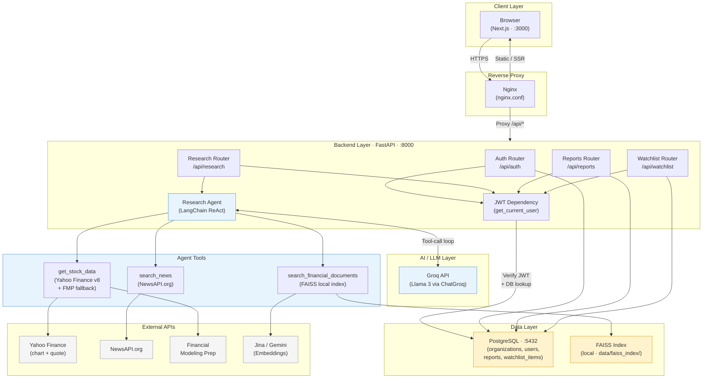
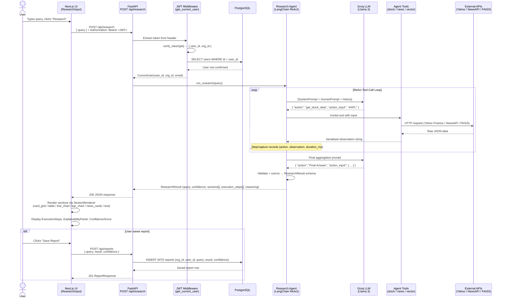
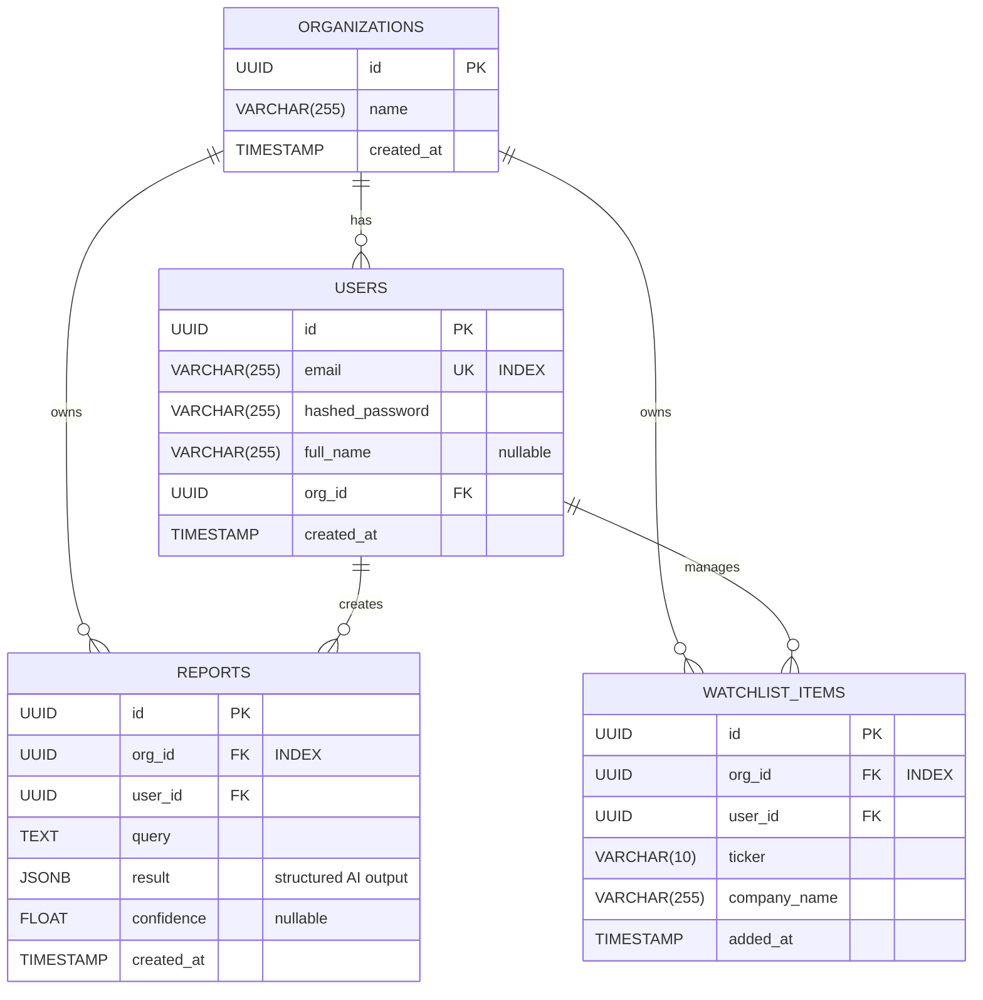
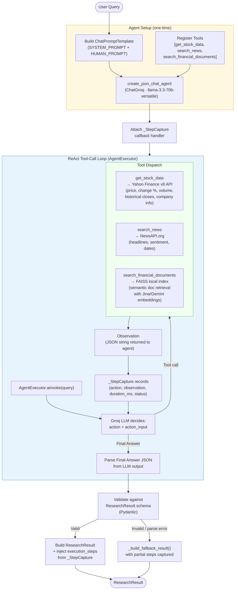
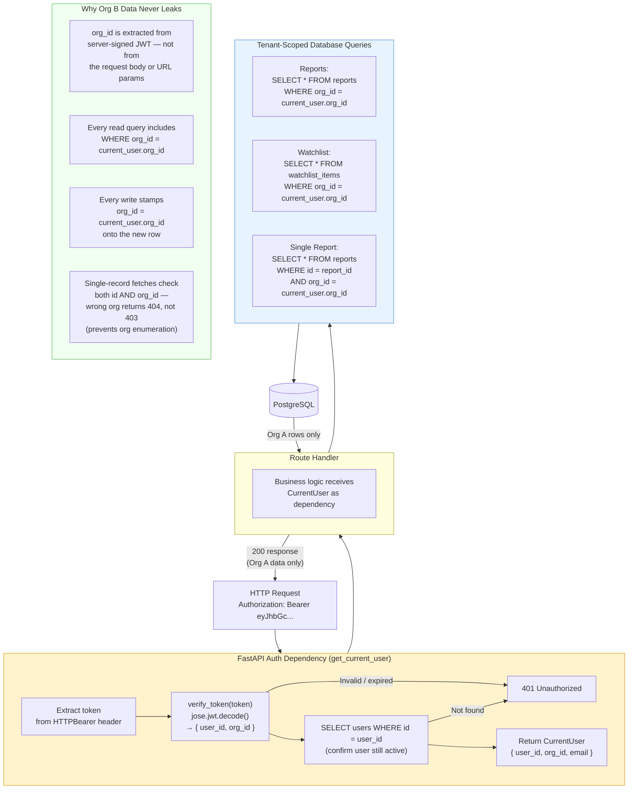

# Architecture — Investment Research Dashboard

## Table of Contents
1. [System Architecture Diagram](#1-system-architecture-diagram)
2. [Data Flow Diagram](#2-data-flow-diagram)
3. [Database Schema / ER Diagram](#3-database-schema--er-diagram)
4. [AI Orchestration Flow](#4-ai-orchestration-flow)
5. [Multi-Tenant Data Flow](#5-multi-tenant-data-flow)
6. [API Design](#6-api-design)

---

## 1. System Architecture Diagram

This diagram shows every piece of the system and how they are connected — like a map of a city showing the roads between neighbourhoods. Each box is a separate component, and the arrows show which direction data travels between them.



---

## 2. Data Flow Diagram

This diagram follows a single research query from the moment you press the "Research" button to the moment the charts and cards appear on screen. Read it top to bottom — each arrow is a handoff from one part of the system to the next.



---

## 3. Database Schema / ER Diagram

This diagram shows how data is organised in storage — like a blueprint of the filing cabinets. Each box is a table (a type of record), each row inside it is a field (a piece of information), and the lines between boxes show which records are linked to each other.



### Index & Constraint Notes

| Table | Column(s) | Type | Purpose |
|---|---|---|---|
| `users` | `email` | UNIQUE + INDEX | Fast lookup on login, prevents duplicate accounts |
| `reports` | `org_id` | INDEX | Tenant-scoped list queries |
| `watchlist_items` | `org_id` | INDEX | Tenant-scoped list queries |
| `watchlist_items` | `(user_id, ticker)` | UNIQUE CONSTRAINT `uq_user_ticker` | Prevents duplicate tickers per user |

### Key Design Decisions

- **Every record has a random ID (UUID)** — instead of IDs like 1, 2, 3 that anyone could guess, every record gets a long random code. This means a curious user cannot simply try ID number 42 to see if another user's report exists.
- **Research results are stored as a flexible blob** — a saved report can contain charts, tables, news cards, or any combination. Rather than having a separate database column for each possible piece of data, the whole report is stored as a single flexible package. This means the AI can change what it returns without requiring database changes.
- **Every record tracks both the workspace and the individual user** — this means the system can support both "show all reports in this team's workspace" and "show only the reports this specific person created", without any future changes to the database structure.
- **A private workspace is created automatically on signup** — you never have to set one up. And because the structure already supports multiple users per workspace, adding team-invite features later requires no database changes.

---

## 4. AI Orchestration Flow

This diagram shows what happens inside the AI layer when you ask a research question. The AI does not just answer from memory — it follows a step-by-step process: read the question, decide which tools to use, call those tools one at a time, collect the results, and finally write a structured answer. Think of it as a researcher following a checklist before writing a report.



### What the AI Can Produce — Section Types

Every section in the final report has a fixed "type" that tells the website how to display it. The AI picks from this list — it cannot invent new types the website does not know how to show.

| Section Type | How It Displays | Where the Data Comes From |
|---|---|---|
| `summary` | A paragraph of text | Written by the AI |
| `company_overview` | A grid of info cards (price, market cap, etc.) | Live stock data from Yahoo Finance |
| `stock_performance` | A line chart of price history | Live historical prices from Yahoo Finance |
| `financial_comparison` | A table or bar chart comparing two+ companies | Live stock data for each company |
| `news_sentiment` | A row of news article cards with headlines | Recent articles from NewsAPI |
| `risk_analysis` | Text or cards highlighting risk factors | AI synthesis + financial document search |

---

## 5. Multi-Tenant Data Flow

This diagram shows how the system makes sure you only ever see your own data — and never anyone else's. Every request goes through an identity check before touching the database, and every database query is locked to your private workspace.



### What Is Inside a Login Token

```json
{
  "sub": "<your user ID>",
  "org_id": "<your private workspace ID>",
  "iat": 1713744000,
  "exp": 1713830400
}
```

- The token is **digitally signed by the server** — any attempt to alter it (e.g. to change the workspace ID to someone else's) immediately breaks the signature and the server rejects it.
- Your workspace ID is written into the token **by the server at login time** — you cannot supply or change it yourself.
- Tokens **expire after 24 hours**, after which you need to log in again to get a fresh one.

---

## 6. API Design

This section lists every URL the backend exposes, what you send to it, and what you get back. Think of each endpoint as a specific counter in an office — you go to the right counter, hand over a form, and get a response back.

### Base URL: `http://localhost:8000`

---

### Authentication — `/api/auth`

#### `POST /api/auth/signup`
Create a new account. A private workspace is automatically set up in the background — you do not need to do anything extra.

| | |
|---|---|
| **Auth required** | No |
| **Request** | `application/json` |
| **Response** | `201 Created` |

```json
// Request
{
  "email": "alice@example.com",
  "password": "s3cureP@ss",
  "full_name": "Alice Smith"         // optional
}

// Response
{
  "access_token": "eyJhbGciOiJIUzI1...",
  "token_type": "bearer"
}
```

Errors: `409 Conflict` — email already registered.

---

#### `POST /api/auth/login`
Sign in with your email and password. Returns a login token you attach to all future requests to prove who you are.

| | |
|---|---|
| **Auth required** | No |
| **Request** | `application/json` |
| **Response** | `200 OK` |

```json
// Request
{
  "email": "alice@example.com",
  "password": "s3cureP@ss"
}

// Response
{
  "access_token": "eyJhbGciOiJIUzI1...",
  "token_type": "bearer"
}
```

Errors: `401 Unauthorized` — invalid credentials.

---

#### `GET /api/auth/me`
Fetch your own profile details (name, email, account ID). Useful for showing your name in the navigation bar.

| | |
|---|---|
| **Auth required** | Yes — `Authorization: Bearer <token>` |
| **Response** | `200 OK` |

```json
// Response
{
  "id": "3fa85f64-5717-4562-b3fc-2c963f66afa6",
  "email": "alice@example.com",
  "full_name": "Alice Smith",
  "org_id": "8e72c4b1-...",
  "created_at": "2025-04-01T10:00:00"
}
```

---

### Research — `/api/research`

#### `POST /api/research`
The main feature of the app. You send a natural language question and get back a full structured report — price charts, company cards, news articles, and a confidence score — all broken into labelled sections ready for the website to display.

| | |
|---|---|
| **Auth required** | Yes |
| **Request** | `application/json` |
| **Response** | `200 OK` |

```json
// Request
{
  "query": "Analyse Apple's recent stock performance and news sentiment"
}

// Response
{
  "query": "Analyse Apple's recent stock performance and news sentiment",
  "confidence": 0.87,
  "sections": [
    {
      "type": "company_overview",
      "render_as": "card_grid",
      "title": "Apple Inc. (AAPL)",
      "data": { "price": 189.30, "change_percent": 1.24, "market_cap": "2.93T" },
      "source": "get_stock_data",
      "explanation": "Live quote from Yahoo Finance."
    },
    {
      "type": "stock_performance",
      "render_as": "line_chart",
      "title": "30-Day Price History",
      "data": { "labels": ["2025-03-01", "..."], "values": [182.5, "..."] },
      "source": "get_stock_data",
      "explanation": "Historical daily closes over the past 35 days."
    },
    {
      "type": "news_sentiment",
      "render_as": "news_cards",
      "title": "Recent News",
      "data": { "articles": [{ "title": "Apple hits record...", "url": "..." }] },
      "source": "search_news",
      "explanation": "Top 5 articles from NewsAPI."
    }
  ],
  "execution_steps": [
    { "tool": "get_stock_data", "input": "AAPL", "duration_ms": 812, "status": "success" },
    { "tool": "search_news",    "input": "Apple stock",  "duration_ms": 420, "status": "success" }
  ],
  "reasoning": "Retrieved live price data and recent news to provide a comprehensive overview."
}
```

Errors: `400 Bad Request` — empty query; `401 Unauthorized`.

---

### Reports — `/api/reports`

#### `POST /api/reports`
Save a completed research result so you can come back to it later. The saved report is only visible within your own private workspace.

| | |
|---|---|
| **Auth required** | Yes |
| **Request** | `application/json` |
| **Response** | `201 Created` |

```json
// Request
{
  "query": "Analyse Apple...",
  "result": { /* full ResearchResult object */ },
  "confidence": 0.87
}

// Response
{
  "id": "uuid",
  "org_id": "uuid",
  "user_id": "uuid",
  "query": "Analyse Apple...",
  "result": { /* ... */ },
  "confidence": 0.87,
  "created_at": "2025-04-22T14:30:00"
}
```

---

#### `GET /api/reports`
Get the list of all reports saved in your workspace, sorted newest first. You can pass a `search` word to filter by the original question text.

| | |
|---|---|
| **Auth required** | Yes |
| **Query params** | `search` (optional) — filters `query` text with `ILIKE` |
| **Response** | `200 OK` — array of `ReportListItem` |

```json
// Response
[
  {
    "id": "uuid",
    "query": "Analyse Apple...",
    "confidence": 0.87,
    "created_at": "2025-04-22T14:30:00"
  }
]
```

---

#### `GET /api/reports/{report_id}`
Open a single saved report by its ID. If the report belongs to a different user's workspace, the server returns "not found" — it will not confirm whether the report exists at all.

| | |
|---|---|
| **Auth required** | Yes |
| **Response** | `200 OK` — full `ReportResponse` |

Errors: `404 Not Found` — report does not exist or belongs to another workspace.

---

#### `DELETE /api/reports/{report_id}`
Permanently delete a saved report. Only works on reports in your own workspace.

| | |
|---|---|
| **Auth required** | Yes |
| **Response** | `204 No Content` |

Errors: `404 Not Found`.

---

### Watchlist — `/api/watchlist`

#### `POST /api/watchlist`
Add a company to your watchlist using its stock ticker symbol (e.g. `AAPL` for Apple). Each ticker can only be added once per user.

| | |
|---|---|
| **Auth required** | Yes |
| **Request** | `application/json` |
| **Response** | `201 Created` |

```json
// Request
{
  "ticker": "AAPL",
  "company_name": "Apple Inc."
}

// Response
{
  "id": "uuid",
  "org_id": "uuid",
  "user_id": "uuid",
  "ticker": "AAPL",
  "company_name": "Apple Inc.",
  "added_at": "2025-04-22T14:30:00"
}
```

Errors: `409 Conflict` — ticker already in watchlist for this user.

---

#### `GET /api/watchlist`
Get all companies currently on your watchlist, sorted by the date you added them (most recent first).

| | |
|---|---|
| **Auth required** | Yes |
| **Response** | `200 OK` — list of watchlist items |

---

#### `DELETE /api/watchlist/{item_id}`
Remove a company from your watchlist.

| | |
|---|---|
| **Auth required** | Yes |
| **Response** | `204 No Content` |

Errors: `404 Not Found`.

---

### Health

#### `GET /api/health`
A simple "is the server running?" check. Returns immediately with no authentication needed. Useful for monitoring tools to confirm the service is alive.

```json
{ "status": "healthy", "service": "Investment Research Dashboard API" }
```

---

### Endpoint Summary Table

| Method | Path | Auth | Description |
|---|---|---|---|
| `POST` | `/api/auth/signup` | No | Register new user + org |
| `POST` | `/api/auth/login` | No | Authenticate, get JWT |
| `GET` | `/api/auth/me` | Yes | Current user profile |
| `POST` | `/api/research` | Yes | Run AI research query |
| `POST` | `/api/reports` | Yes | Save research report |
| `GET` | `/api/reports` | Yes | List org reports (+ search) |
| `GET` | `/api/reports/{id}` | Yes | Get single report |
| `DELETE` | `/api/reports/{id}` | Yes | Delete report |
| `POST` | `/api/watchlist` | Yes | Add ticker to watchlist |
| `GET` | `/api/watchlist` | Yes | List org watchlist |
| `DELETE` | `/api/watchlist/{id}` | Yes | Remove watchlist item |
| `GET` | `/api/health` | No | Liveness check |
